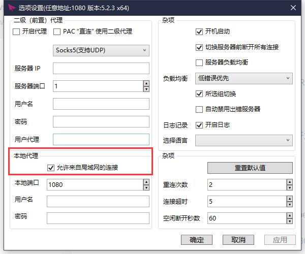
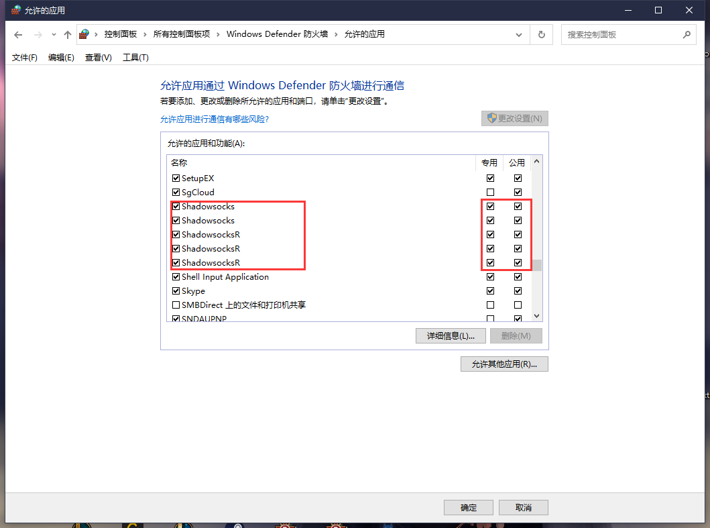

# 一、安装WSL2
<hr style="height:1px; background-color:#999" />

参照 https://docs.microsoft.com/en-us/windows/wsl/install-win10

<br />
<br />

# 二、安装docker desktop windows
<hr style="height:1px; background-color:#999" />

参照 https://docs.docker.com/docker-for-windows/install/


<br />
<br />

# 三、docker在wsl2下的设置
<hr style="height:1px; background-color:#999" />

参照 https://docs.docker.com/docker-for-windows/wsl/


<br />
<br />

# 四、WSL2科学上网
<hr style="height:1px; background-color:#999" />

>  对应的软件设置为允许局域网连接（我使用的是SSR）  
 


>  防火墙设置放行




>  在wsl2 terminal中打开```vim ~/.bashrc```（vscode中打开为 ```code ~/.bashrc```），在最下边添加如下代码

```bash
# set http proxy
WSL_MASTER_HOST_IP=`cat /etc/resolv.conf | grep nameserver | awk '{print $2}'`

export http_proxy="http://${WSL_MASTER_HOST_IP}:1080"  # 此处端口对应SSR的本地端口1080

export https_proxy=$http_proxy

export all_proxy=$http_proxy

# set git config http proxy

if [ "`git config --global --get http.proxy`" != "http://$WSL_MASTER_HOST_IP:1080" ]; then

  git config --global http.proxy http://$WSL_MASTER_HOST_IP:1080

fi
```

如果是使用zsh则是打开 ```vim ~/.zshrc```（或者```code ~/.zshrc```），添加上边的代码到末尾


<br />
<br />


# 五、docker项目中文件权限
<hr style="height:1px; background-color:#999" />

>  遇到读写权限问题时，在wsl2下设置文件夹权限为777即可

```bash
# 例如我的工作目录为 ~/workspace

cd ~/

sudo chmod -R 777 workspace/

```

